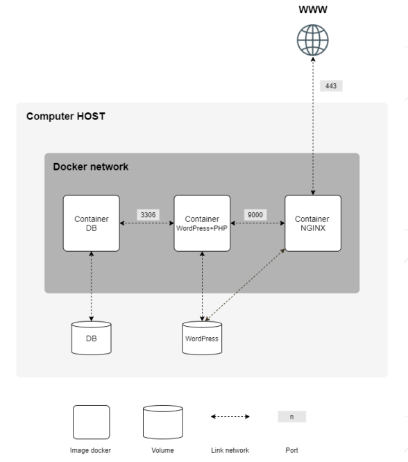

## Architecture:

All sensitive credentials and database passwords must not be hardcoded. They are managed via a .env file and Docker Secrets stored in a top-level secrets/ directory.

- secrets/
  - credentials.txt
  - db_password.txt
  - db_root_password.txt
  - wp_user_password.txt
- srcs/
  - requirements/
    - bonus/
      - adminer/
        - Dockerfile
      - cadvisor/
        - Dockerfile
      - ftp/
        - conf/
          - vsftpd.conf
        - tools/
          - setup_ftp.sh
        - Dockerfile
      - redis/
        - Dockerfile
      - static_site/
        - conf/
          - nginx.conf
        - tools/
          - index.html
        - Dockerfile
    - mariadb/
      - conf/
        - 50-server.cnf
      - tools/
        - entrypoint.sh
      - Dockerfile
    - nginx/
      - conf/
        - nginx.conf
      - tools/
        - entrypoint.sh
      - Dockerfile
    - wordpress/
      - conf/
        - www.conf
      - tools/
        - entrypoint.sh
      - Dockerfile
  - .env
  - docker-compose.yml
- Makefile


for the .env, check the .env.example
for secrets: 
```bash
mkdir -p secrets

# Database Root Password
echo -n "<insert_db_root_password>" > secrets/db_root_password.txt

# Database User Password
echo -n "<insert_db_user_password>" > secrets/db_password.txt

# WordPress Administrator Account Password
echo -n "<insert_wp_admin_password>" > secrets/credentials.txt

# WordPress User / FTP Account Password
echo -n "<insert_ftp_user_password>" > secrets/wp_user_password.txt

# Secure file permissions
chmod 600 secrets/*.txt
```
___


This is the base of the structure, I added adminer, cadvisor, ftp, redis, and static site containers.


## 2. Prerequisites & Initial Environment Setup

### System Prerequisites
* Operating System: **Linux (Debian / Ubuntu / 42 VM)**
* Utilities: `make`, `docker`, `docker-compose-v2` (or `docker compose`), `curl`

### Host Directory Preparation
Ensure the storage directories exist with proper permissions on the host system:
```bash
sudo mkdir -p /home/pgougne/data/mariadb
sudo mkdir -p /home/pgougne/data/wordpress
sudo chmod -R 755 /home/pgougne/data
```


## Domain Name Configuration (/etc/hosts)
Map your local domain to 127.0.0.1 in the host's /etc/hosts file:

```bash
echo "127.0.0.1 pgougne.42.fr" | sudo tee -a /etc/hosts
```


Main commands:

Building images and starting containers:
> make all
___

Building images:
> make build
___

Starting containers: 
> make up
___

Stopping containers:
> make down
___

Cleaning containers, networks, and images:
> make clean
___

Cleaning containers, networks, and images and Deleting /data directories:
> make fclean

Check running containers:
> docker ps
___

View container resource usage (CPU/Memory):
> docker stats
___

Inspect container networks:
> docker network inspect inception_network
___

Inspect volume storage details:
> docker volume inspect srcs_wp_data srcs_db_data
___

Stream logs for all services:
> docker compose -f srcs/docker-compose.yml logs -f
___

Stream logs for a specific service (e.g., FTP):
> docker logs -f ftp
___

Open an interactive shell inside a running container:
> docker exec -it wordpress bash\
docker exec -it mariadb mariadb -u root -p\
docker exec -it ftp bash


## Data Storage & Persistence Strategy

Data persistence is managed using Docker Volumes configured with bind mounts pointing to dedicated host paths. This ensures that resetting or rebuilding containers will never lose site data or database entries.
Storage Mapping Table
| Volume Name | Target Path inside Container | Host Directory | Persisted Data |
|:--------------:|:--------------:|:--------------:|:--------------:|
| db_data | /var/lib/mysql | /home/pgougne/data/mariadb | MariaDB tables, user privileges, WordPress database schemas |
| wp_data | /var/www/html | /home/pgougne/data/wordpress | WordPress core, themes, plugins, uploaded media files |


## Docker Compose Volume Definition
```yaml
volumes:
  db_data:
    driver: local
    driver_opts:
      type: none
      o: bind
      device: /home/pgougne/data/mariadb
  wp_data:
    driver: local
    driver_opts:
      type: none
      o: bind
      device: /home/pgougne/data/wordpress
```

## Data Lifecycle & Safety
**Container Restart / Rebuild** (make down / make up): Data in /home/pgougne/data/ remains untouched.

**Container Crash**: Docker automatically restarts the container (restart: always), mounting the exact same persistent storage.

**Full Purge** (make fclean): Safely stops services and deletes the content of /home/pgougne/data/ to allow testing from a clean state.


## Testing
**Nginx (HTTPS port 443)** 
> curl -k https://localhost/

**Static Site(HTTP port 8081)**
> curl -i http://localhost:8081/

**Adminer (HTTP port 8080)**
> curl -i http://localhost:8080/adminer.php

**cAdvisor (HTTP port 8082)**
> curl -i http://localhost:8082/

**FTP (Passive Mode)**
> curl -T /etc/hosts ftp://127.0.0.1:21/test.txt --user "pgougne:UserPass123"\
docker exec -it wordpress ls -la /var/www/html/

