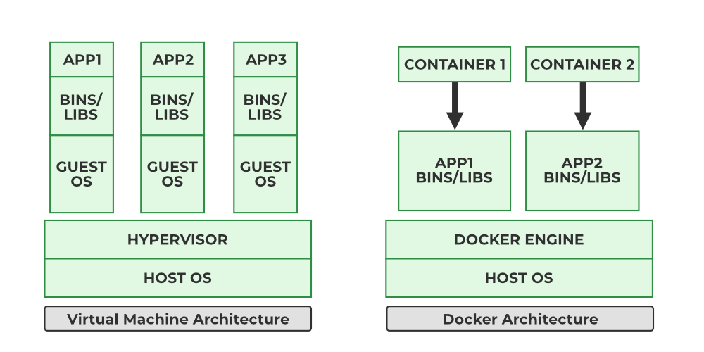
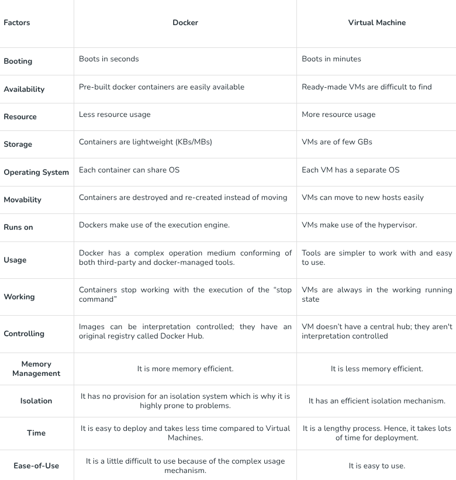
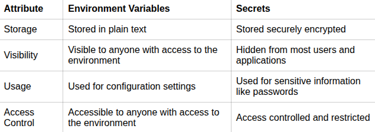
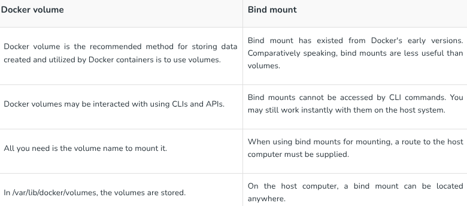

_This project has been created as part of the 42 curriculum by pgougne._

# Description
This project is about building an infrastructure of isolated services (Nginx, WordPress, MariaDB, and additional bonus tools) using Docker and Docker Compose.
While standard Docker projects often pull pre-configured application images directly from Docker Hub (like nginx or wordpress), the 42 subject requires us to build our own custom images from a base OS image (Debian Bookworm) using dedicated Dockerfiles. This ensures full control over configuration, environment variables, security, and service initialization.

# Instructions

Building images and starting containers:
> make all
___

Building images:
> make build
___

Starting containers: 
> make up
___

Stopping containers:
> make down
___

Cleaning containers, networks, and images:
> make clean
___

Cleaning containers, networks, and images and Deleting /data directories:
> make fclean

Main command for correction:
# Nginx (HTTPS port 443)
curl -k https://localhost/

# Static Site(HTTP port 8081)
curl -i http://localhost:8081/

# Adminer (HTTP port 8080)
curl -i http://localhost:8080/adminer.php

# cAdvisor (HTTP port 8082)
curl -i http://localhost:8082/

# FTP (Passive Mode)
test:
curl -T /etc/hosts ftp://127.0.0.1:21/test.txt --user "pgougne:UserPass123"
docker exec -it wordpress ls -la /var/www/html/

# Resources
https://www.golinuxcloud.com/install-deb-file-debian/
https://dev.to/bobrundle/how-to-fix-wordpress-error-establishing-a-database-connection-idl
https://cs4118.github.io/dev-guides/vm-ssh.html
https://www.debian.org/releases/bookworm/debian-installer/
https://redis.io/tutorials/operate/orchestration/docker/
https://mariadb.com/docs/server/server-management/automated-mariadb-deployment-and-administration/docker-and-mariadb/installing-and-using-mariadb-via-docker
https://www.digitalocean.com/community/tutorials/how-to-install-wordpress-with-docker-compose
https://indumathimanivannan.medium.com/docker-network-modes-explained-bridge-host-and-overlay-comparisons-d691857f9d30
https://www.geeksforgeeks.org/devops/docker-or-virtual-machines-which-is-a-better-choice/
https://thisvsthat.io/environment-variables-vs-secrets
https://linux.die.net/man/5/vsftpd.conf
https://www.cyberciti.biz/tips/vsftp-chroot-users-limit-to-only-their-home-directory.html

How AI was used ?
Ai was used throughout this project as a support and learning assistant.

- Debugging:

  - Explain unexpected behaviors
  - Suggest potential causes of bugs

- Understanding Docker and commands:
  - Get some example
  - Complet the documentation

- Global Assistance:

  - Discuss best practices
  - Helping me build some files

# Additionnal sections

## Virtual Machines vs Docker

## Secrets vs Environment Variables
Environment variables and secrets are both used to store sensitive information in a secure manner. However, environment variables are typically used to store configuration settings that are not considered highly sensitive, such as API keys or database connection strings. On the other hand, secrets are used to store highly sensitive information, such as passwords or encryption keys, and are typically encrypted at rest and in transit.

## Docker Network vs Host Network
Docker Network (Bridge) mode creates an isolated network for containers, allowing them to communicate with each other and the host through a virtual bridge, while Host Network mode allows containers to share the host's network stack directly, providing higher performance but less isolation.

## Docker Volumes vs Bind Mounts

Docker volume and Bind mount are the docker components. Using bind mounts, you may mount a file or directory from your host computer onto your container and access it using its absolute path. Because Docker does everything independently, it is not dependent on the host computer's operating system or your directory structure. The Docker CLI commands or the Docker API may be used to manage Docker Volumes. It is safer to share quantities among many containers. The host computer's absolute path to the file or directory serves as a point of reference. Conversely, when a volume is used, Docker makes a new directory in the host machine's storage directory and keeps it updated.

# Bonus Services:
Redis (Object Cache)

An in-memory data structure store integrated with WordPress as an object cache. It speeds up page loading times by caching database query results, significantly reducing MariaDB workload.

FTP Server (vsftpd)

A secure File Transfer Protocol server targeting the WordPress web directory (/var/www/html). It enables seamless remote file management and direct upload/download of site assets using system credentials.

Adminer (Database Management)

A lightweight, single-file web-based database management tool listening on port 8080. It provides a simple graphical interface to inspect, query, and manage the MariaDB database without using CLI tools.

Static Website

A standalone static HTML/CSS web page served by a dedicated Nginx server on port 8081. It operates completely independently from the main WordPress application to showcase multi-site serving.

cAdvisor (Container Monitoring)

Google's Container Advisor running on port 8082. It collects, aggregates, and visualizes real-time performance metrics (CPU usage, memory consumption, network activity) for all running Docker containers.
